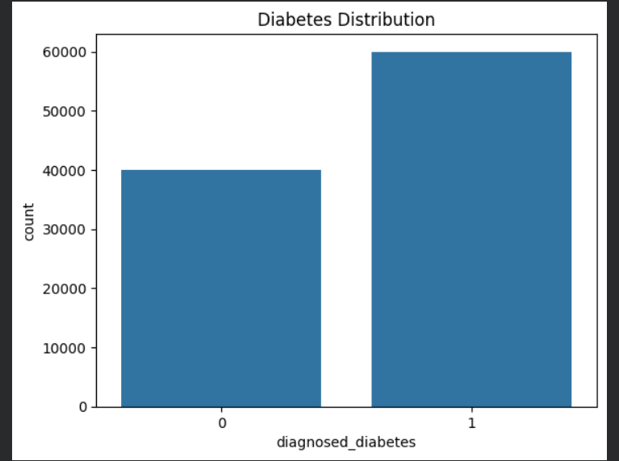
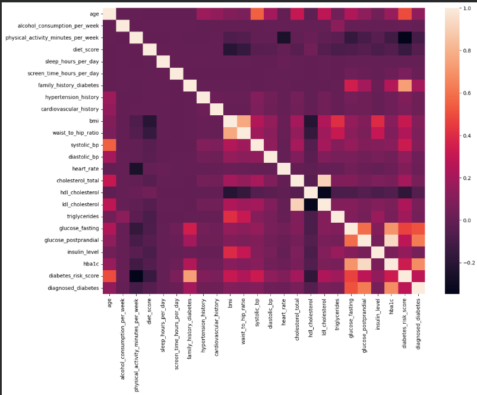
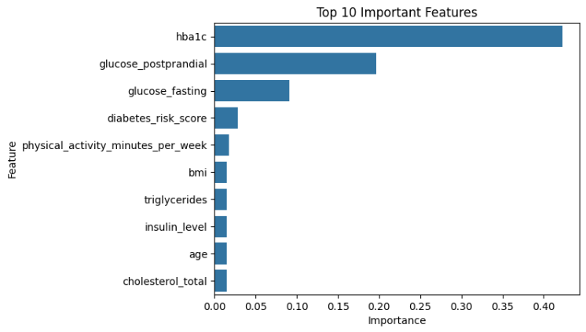
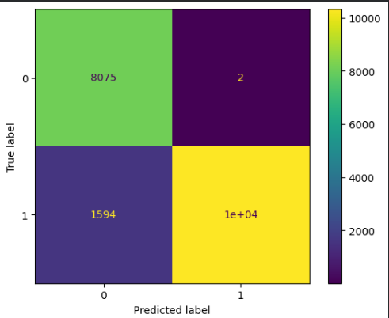

# 🩺 Diabetes Prediction Using Machine Learning


---

## 📌 Project Overview

Diabetes is one of the fastest-growing chronic diseases worldwide, making early prediction an important step toward better healthcare. This project uses Machine Learning techniques to predict whether a patient is likely to have diabetes based on demographic, lifestyle, and clinical health data.

The project demonstrates a complete machine learning workflow—from data preprocessing and exploratory data analysis (EDA) to model training, evaluation, and feature importance analysis.

---

## 🎯 Objective

The goal of this project is to build an accurate machine learning model that can predict diabetes and compare the performance of multiple classification algorithms to identify the best-performing model.

---

## 📂 Dataset Information

The dataset contains approximately **100,000 patient records** with demographic, lifestyle, and medical information.

### Features include:

- Age
- Gender
- Ethnicity
- BMI
- Blood Pressure
- Cholesterol Levels
- HbA1c
- Glucose Levels
- Physical Activity
- Smoking Status
- Family History
- Lifestyle Factors

**Target Variable**

- **0** → No Diabetes
- **1** → Diabetes

---

## 🛠️ Technologies Used

- Python
- Pandas
- NumPy
- Matplotlib
- Seaborn
- Scikit-learn
- Google Colab

---

## 📊 Exploratory Data Analysis

The following analyses were performed:

- Data Cleaning
- Missing Value Checking
- Duplicate Record Checking
- Target Variable Analysis
- Distribution Plots
- Correlation Analysis
- Feature Encoding
- Feature Engineering

---

# 📸 Project Visualizations

## Diabetes Distribution



---

## Correlation Heatmap



---

## Feature Importance



---

## Confusion Matrix



---

## 🤖 Machine Learning Models

The following models were trained and evaluated:

- Logistic Regression
- K-Nearest Neighbors (KNN)
- Decision Tree Classifier
- Random Forest Classifier

---

## 📈 Model Performance

| Model | Accuracy |
|--------|---------:|
| Logistic Regression | 83.98% |
| K-Nearest Neighbors | 80.85% |
| Decision Tree | 86.23% |
| **Random Forest** | **92.02%** ✅ |

The **Random Forest Classifier** achieved the highest accuracy and provided the best overall performance among all the tested models.

---

## 🔍 Key Findings

The most important features influencing diabetes prediction were:

- HbA1c
- Postprandial Glucose
- Fasting Glucose
- Diabetes Risk Score
- BMI
- Physical Activity
- Triglycerides
- Insulin Level
- Age

---

## 🚀 How to Run the Project

### Clone the repository

```bash
git clone https://github.com/mandardodwad2005/Diabetes-Prediction-Using-Machine-Learning.git
```

### Install the required libraries

```bash
pip install -r requirements.txt
```

### Run the notebook

Open:

```
Diabetes_prediction.ipynb
```

and execute all cells.

---

## 📁 Project Structure

```
Diabetes-Prediction-Using-Machine-Learning/
│
├── images/
│   ├── Diabetes_distribution_plot.png
│   ├── Correlation_heatmap.png
│   ├── Feature_importance.png
│   └── Confusion_matrix.png
│
├── Diabetes_prediction.ipynb
├── requirements.txt
├── Project_Diabetes Prediction Using Machine Learning.pdf
└── README.md
```

---

## 🌟 Future Improvements

- Hyperparameter Tuning
- Cross Validation
- XGBoost & LightGBM Models
- Model Deployment using Streamlit or Flask
- Real-time Diabetes Prediction Web Application

---

## 👨‍💻 Author

**Mandar Dodwad**

Electronics & Computer Engineering Student

Interested in **Java, Backend Development, Machine Learning, and Software Development.**

---

## ⭐ Support

If you found this project useful, please consider giving it a ⭐ on GitHub.

Feedback and suggestions are always welcome!
